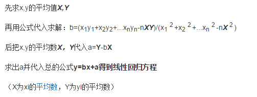

<!--
@Author: sunquan  
@DateTime 2017-06-14 T10:24:33+0800
@email: sunquana@gmail.com
Copyright@2017  
--> 

 <h2>CUDA Libs and SDKs</h2>

[sunquan](mailto:sunquana@gmail.com) 2017-06-14   

[TOC]

### 1 Preface
<!-- 才发现之前用协同过滤写的ACM题目推荐算法，现在才意识到这是属于数据挖掘的范畴。-->
  有三种常见的开发 CUDA 应用程序的方式：

- 使用函数库  
- 基于指令的编程  
- 直接编写 CUDA 内核 

### 2 CUDA 函数库
#### 2.1 Develop [Libs](https://developer.nvidia.com/gpu-accelerated-libraries)
- Thrust 一个C++ STL 实现的函数库
- CuBLAS (基本线性代数)函数库的GPU版本
- ...

### 3 网格模型
下面来理解下 CUDA 的网格模型：  
>当前 GPU 上的一个线程束的大小是 `warpSize = 32`

wait

>GPU 编程：就像一支拥有千军万马的军队 (thread)，而你正是这支军队的Leader，你要做的就是有序而高效的指挥这支军队(解决实际问题)。

###  4 Matrix Calculation
注意点：GPU是不适合用来做判断的，所以像下面这个期货高频公式的分支判断需要放在CPU运算。 

### 5 `Linear Regression` 
#### 5.1 线性回归最小二乘  

When $a \ne 0$, there are two solutions to $ ax^2 + bx + c = 0 $ and they are

$$x = {-b \pm \sqrt{b^2-4ac} \over 2a}.$$

$$ standard\_bias = \sqrt{\frac{1}{n-1}\sum_{i=0}^n (y_i - \bar y)^2}$$

### Reference
[1] [Nvidia 开发者文档](http://docs.nvidia.com/cuda/cuda-installation-guide-microsoft-windows/index.html)   
[2] CUDA并行程序设计：GPU编程指南· Shane Cook 著   
 

#### 待补充
- 1 根据股票的买1和卖1 线性回归 算出斜率 3s/帧 1分钟的行情
   同时计算3000只代码的斜率
- 2 补充矩阵计算那块 

