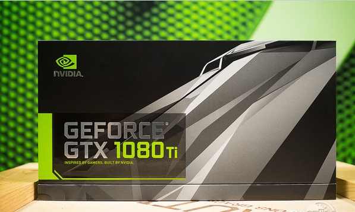

<!--
@Author: sunquan  
@DateTime 2017-06-12 T10:24:33+0800
@email: sunquana@gmail.com
Copyright@2017  
--> 
<center> <h2>Develop Environment Performance Test(Archlinux)</h2></center>
<p align="right">[sunquan](mailto:sunquana@gmail.com) 2017-06-14   </p>


[TOC]

## 1 Preface
开发环境显卡型号N卡: `GTX 1080 TI `  

## 2 CUDA 环境搭建 

#### 2.1 查看 nvcc 版本
安装完成后，检查是否成功安装。  
在终端输入 `nvcc -V`, 查看 nvcc 版本。
```
[toptrade@gpu ~]$ nvcc -V
nvcc: NVIDIA (R) Cuda compiler driver
Copyright (c) 2005-2016 NVIDIA Corporation
Built on Tue_Jan_10_13:22:03_CST_2017
Cuda compilation tools, release 8.0, V8.0.61
```

我们用开发包里面自带的工具，先了解下显卡的参数和性能指标：  
> 工具路径： ~/NVIDIA_CUDA-8.0_Samples/bin/x86_64/linux/release/

#### 2.2 执行 **deviceQuery** 可以查看显卡设备 
```
[toptrade@gpu ~]$  cd ~/NVIDIA_CUDA-8.0_Samples/bin/x86_64/linux/release/ && ./deviceQuery
./deviceQuery Starting...

 CUDA Device Query (Runtime API) version (CUDART static linking)

Detected 1 CUDA Capable device(s)

Device 0: "Graphics Device"
  CUDA Driver Version / Runtime Version          8.0 / 8.0
  CUDA Capability Major/Minor version number:    6.1
  Total amount of global memory:                 11170 MBytes (11712987136 bytes)
  (28) Multiprocessors, (128) CUDA Cores/MP:     3584 CUDA Cores
  GPU Max Clock rate:                            1582 MHz (1.58 GHz)
  Memory Clock rate:                             5505 Mhz
  Memory Bus Width:                              352-bit
  L2 Cache Size:                                 2883584 bytes
  Maximum Texture Dimension Size (x,y,z)         1D=(131072), 2D=(131072, 65536), 3D=(16384, 16384, 16384)
  Maximum Layered 1D Texture Size, (num) layers  1D=(32768), 2048 layers
  Maximum Layered 2D Texture Size, (num) layers  2D=(32768, 32768), 2048 layers
  Total amount of constant memory:               65536 bytes
  Total amount of shared memory per block:       49152 bytes
  Total number of registers available per block: 65536
  Warp size:                                     32
  Maximum number of threads per multiprocessor:  2048
  Maximum number of threads per block:           1024
  Max dimension size of a thread block (x,y,z): (1024, 1024, 64)
  Max dimension size of a grid size    (x,y,z): (2147483647, 65535, 65535)
  Maximum memory pitch:                          2147483647 bytes
  Texture alignment:                             512 bytes
  Concurrent copy and kernel execution:          Yes with 2 copy engine(s)
  Run time limit on kernels:                     Yes
  Integrated GPU sharing Host Memory:            No
  Support host page-locked memory mapping:       Yes
  Alignment requirement for Surfaces:            Yes
  Device has ECC support:                        Disabled
  Device supports Unified Addressing (UVA):      Yes
  Device PCI Domain ID / Bus ID / location ID:   0 / 1 / 0
  Compute Mode:
     < Default (multiple host threads can use ::cudaSetDevice() with device simultaneously) >

deviceQuery, CUDA Driver = CUDART, CUDA Driver Version = 8.0, CUDA Runtime Version = 8.0, NumDevs = 1, Device0 = Graphics Device
Result = PASS
```

#### 2.3 用 **bandwidthTest**测试显卡带宽
(1) 申请 操作系统固定的内存 (cudaMalloc) OS-pinned memory  
`Result：12G/s`
```
[toptrade@gpu release]$ cd ~/NVIDIA_CUDA-8.0_Samples/1_Utilities/bandwidthTest/  && ./bandwidthTest
[CUDA Bandwidth Test] - Starting...
Running on...

 Device 0: Graphics Device
 Quick Mode

 Host to Device Bandwidth, 1 Device(s)
 PINNED Memory Transfers
   Transfer Size (Bytes)        Bandwidth(MB/s)
   33554432                     12409.2

 Device to Host Bandwidth, 1 Device(s)
 PINNED Memory Transfers
   Transfer Size (Bytes)        Bandwidth(MB/s)
   33554432                     12416.4

 Device to Device Bandwidth, 1 Device(s)
 PINNED Memory Transfers
   Transfer Size (Bytes)        Bandwidth(MB/s)
   33554432                     347695.0

Result = PASS
```

(2) 申请分页内存 (malloc)  
`Result： 3.7G/s`

```cpp
[toptrade@gpu release]$ ./bandwidthTest   --memory=pageable
[CUDA Bandwidth Test] - Starting...
Running on...

 Device 0: Graphics Device
 Quick Mode

 Host to Device Bandwidth, 1 Device(s)
 PAGEABLE Memory Transfers
   Transfer Size (Bytes)        Bandwidth(MB/s)
   33554432                     3858.7

 Device to Host Bandwidth, 1 Device(s)
 PAGEABLE Memory Transfers
   Transfer Size (Bytes)        Bandwidth(MB/s)
   33554432                     3750.5

 Device to Device Bandwidth, 1 Device(s)
 PAGEABLE Memory Transfers
   Transfer Size (Bytes)        Bandwidth(MB/s)
   33554432                     346563.0

Result = PASS
```

## 3 矩阵乘法性能测试
#### 3.1 矩阵乘法 (on CPU)
```cpp
MatrixA(320,320), MatrixB(640,320)
verage = 298.943567 ms
(Size=65536000 Ops, total=8968.307000 ms/30 times)
```

#### 3.2 矩阵乘法 (on GPU)
约`1.3TFLOPS `  (即每秒1.3万亿次的浮点运算)
启动线程块个数：`20*10 `  
每个线程块线程数：`1024`  
浮点运算次数： `1.3亿次`  
计算一次平均耗时：`0.1ms` 
> 300次计算求出的平均值

```cpp
MatrixA(320,320), MatrixB(640,320)
Performance= 1305.40 GFlop/s, Time= 0.100 msec, Size= 131072000 Ops, WorkgroupSize= 1024 threads/block
```

| 指标\Calc |CPU|GPU|
|:---:|:---:|:---:|
|执行线程数| 1 | 204800 |
|样例执行次数|30 | 300|
|平均执行时间| 299ms  |0.1 ms|
|内存消耗| 2M | 4 M|

结论：GPU的计算性能约为 GPU 的 `3000` 倍！
