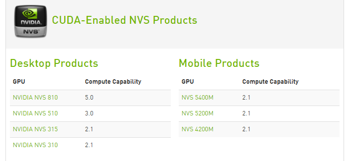

<!--
@Author: sunquan  
@DateTime 2017-06-12 T10:24:33+0800
@email: sunquana@gmail.com
Copyright@2017  
--> 
<center> <h2>How To Build CUDA environment (Windows)</h2></center>
<p align="right">[sunquan](mailto:sunquana@gmail.com) 2017-06-12   </p>


[TOC]

## 1 Preface
> 我和大家一样，都是一次接触 GPU 编程，这中间有地方讲的不正确的地方，还敬请指出！
#### 1.1 首先确认配置的 Nvidia 显卡型号 
   
官网查看CUDA兼容的GPU型号[cuda-gpu](https://developer.nvidia.com/cuda-gpus) `(20170612)`

> CUDA Toolkit on x86_32 is unsupported  

## 2 CUDA 环境搭建
#### 2.1 Download
nvidia [cuda-toolkit](https://developer.nvidia.com/cuda-toolkit)
下载对应的开发包，安装的时候选择自定义安装，然后下一步、下一步即可。
  

#### 2.2 检查是否成功安装
安装完成后，检查是否成功安装。  
(1) cmd 中输入 `nvcc -V`, 查看 nvcc 版本。  
(2) 执行 **deviceQuery.exe** 可以查看显卡设备:  
```
λ deviceQuery
deviceQuery Starting...

 CUDA Device Query (Runtime API) version (CUDART static linking)

Detected 1 CUDA Capable device(s)

Device 0: "NVS 510"
  CUDA Driver Version / Runtime Version          8.0 / 8.0
  CUDA Capability Major/Minor version number:    3.0
  Total amount of global memory:                 2048 MBytes (2147483648 bytes)
  ( 1) Multiprocessors, (192) CUDA Cores/MP:     192 CUDA Cores
  GPU Max Clock rate:                            797 MHz (0.80 GHz)
  Memory Clock rate:                             891 Mhz
  Memory Bus Width:                              128-bit
  L2 Cache Size:                                 262144 bytes
  Maximum Texture Dimension Size (x,y,z)         1D=(65536), 2D=(65536, 65536), 3D=(4096, 4096, 4096)
  Maximum Layered 1D Texture Size, (num) layers  1D=(16384), 2048 layers
  Maximum Layered 2D Texture Size, (num) layers  2D=(16384, 16384), 2048 layers
  Total amount of constant memory:               65536 bytes
  Total amount of shared memory per block:       49152 bytes
  Total number of registers available per block: 65536
  Warp size:                                     32
  Maximum number of threads per multiprocessor:  2048
  Maximum number of threads per block:           1024
  Max dimension size of a thread block (x,y,z): (1024, 1024, 64)
  Max dimension size of a grid size    (x,y,z): (2147483647, 65535, 65535)
  Maximum memory pitch:                          2147483647 bytes
  Texture alignment:                             512 bytes
  Concurrent copy and kernel execution:          Yes with 1 copy engine(s)
  Run time limit on kernels:                     Yes
  Integrated GPU sharing Host Memory:            No
  Support host page-locked memory mapping:       Yes
  Alignment requirement for Surfaces:            Yes
  Device has ECC support:                        Disabled
  CUDA Device Driver Mode (TCC or WDDM):         WDDM (Windows Display Driver Model)
  Device supports Unified Addressing (UVA):      Yes
  Device PCI Domain ID / Bus ID / location ID:   0 / 3 / 0
```

(3)执行 **bandwidthTest.exe**,看到 `Result - Pass`
```
λ bandwidthTest
[CUDA Bandwidth Test] - Starting...
Running on...

 Device 0: NVS 510
 Quick Mode

 Host to Device Bandwidth, 1 Device(s)
 PINNED Memory Transfers
   Transfer Size (Bytes)        Bandwidth(MB/s)
   33554432                     5861.3

 Device to Host Bandwidth, 1 Device(s)
 PINNED Memory Transfers
   Transfer Size (Bytes)        Bandwidth(MB/s)
   33554432                     6536.8

 Device to Device Bandwidth, 1 Device(s)
 PINNED Memory Transfers
   Transfer Size (Bytes)        Bandwidth(MB/s)
   33554432                     20376.2

Result = PASS
```

## 3 Data Interaction
#### 3.1 CPU 和 GPU 之间的如何进行数据交互?
&nbsp;　CPU 和 GPU 有各自独立的内存空间，在 GPU 中不能直接访问 CPU 端的代码，反之也一样。  
这时候最直接的方式就是**数据拷贝**: 在计算前将数据从 CPU 复制到 GPU 端，以 GPU 内存指针的方式传递给 GPU 的内存空间进行读写操作，计算完后将计算结果复制回 CPU 端。下面我们看下一个Sample Project 的代码 `bandwidthTest`   
**函数功能**：测试device to device (or device <==> host)拷贝数据的带宽。  
##### (1) 动态申请连续的内存块
```cpp 
/**char *d_idata: device input data
 * char *h_odata: host output data
 */
  // Host 上动态申请内存
  cudaError_t cudaHostAlloc((void **)&h_odata, memSize, bWriteCombined);
  // device 上动态申请内存
  cudaError_t cudaMalloc((void **) &d_idata, memSize);
```
##### (2) 数据拷贝( host <==> device)
```cpp
  // sync CopyData from Device to Host 
  cudaError_t cudaMemcpy(void *dst, const void *src,size_t memSize, cudaMemcpyDeviceToHost);
  // async CopyData from Host to Device (line 791)
  cudaError_t cudaMemcpyAsync(void *dst, const void *src,size_t memSize, cudaMemcpyHostToDevice, 0);
```
> 数据从device 拷贝回 host 是一个同步数据拷贝。

##### (3) 释放内存
```cpp
  //释放 host 上的内存
  cudaError_t cudaFreeHost(h_odata);
  //释放 device 上的内存
  cudaError_t cudaFree(d_idata);
```
注：(1) 每个函数都需用宏 `checkCudaErrors()` 来检查返回值。  
(2) 有3个宏：`HOST_TO_DEVICE`、`DEVICE_TO_HOST`、`DEVICE_TO_DEVICE`  


## 4 CUDA-Demos  
下面来看个简单的 GPU 计算向量加法的例子。
##### 4.1 Vector Add
CUDA Kernel function: 这段代码只能在GPU上执行，不能在CPU上执行。  
下面来看一个内核函数的例子：
```cpp
/* CUDA Kernel Device code
*/
__global__ void vectorAdd(const float *A, const float *B, float *C, int numElements)
{
    /* build-in variable
     *  blockDim 每个线程块需要启动的线程总数
     *  blockIdx 线程块编号,从0开始编号
     *  threadIdx  线程ID,每个线程块内从0开始编号
     */
    int i = blockDim.x * blockIdx.x + threadIdx.x;

    if (i < numElements) //防止数组越界!!!
    {
        C[i] = A[i] + B[i];
    }
}
```
>其中 `__global__` 告诉编译器生成的是GPU代码而不是 CPU 代码，并且这段代码在 CPU 上是全局可见的。

如何在 CPU 端调用内核函数？  
CUDA 专门定义了一个 C 语言扩展用以调用内核函数。语法如下：
` kernel_function<<< num_blocks, num_threads>>>(params, param2, ...)`  
```cpp
// Launch the Vector Add CUDA Kernel
    int threadsPerBlock = 256;
    int blocksPerGrid =(numElements + threadsPerBlock - 1) / threadsPerBlock;
   
    vectorAdd<<<blocksPerGrid, threadsPerBlock>>>(d_A, d_B, d_C, numElements);

    err = cudaGetLastError();
```
>其中：num_blocks 告诉 GPU 启动线程块的数量；   
> num_threads 表示单个 Block 内启动的线程数。 


> *向量的减法、乘法类似*。

#### 4.2 Matrix Calculation
`next post write`

## 5 CPU 的多线程与 GPU 的对应关系

-  CPU 单线程 / GPU 多线程
-  CPU 多线程 / GPU 多线程 (注意内存的使用)

> GPU 是典型的 SPMD (即单指令多数据模型)。  


## Reference
[1] [Nvidia 开发者文档](http://docs.nvidia.com/cuda/cuda-installation-guide-microsoft-windows/index.html)   
[2] [vs2013下编写你的第一个CUDA程序](http://blog.csdn.net/kyocen/article/details/51424161)　*简单的方式：可以直接新建 CUDA 8.0 的project*  
[3] CUDA并行程序设计：GPU编程指南· Shane Cook 著   
[4] GeForce GTX 280 GPU  
 
> 名词解释：  
> SM:  Streaming Multiprocessor 流处理簇  
> SP:  Stream Processor 流处理器  
> DRAM： 缓存


